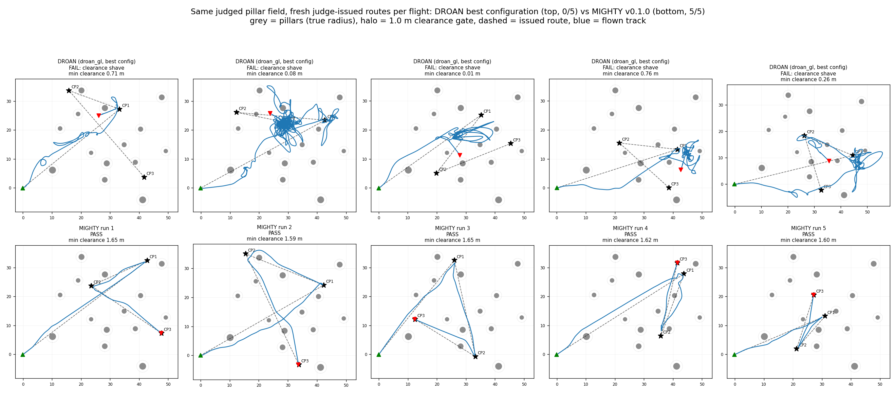
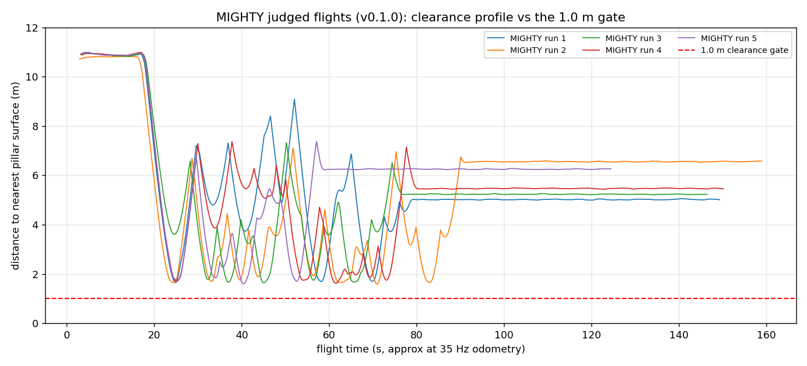
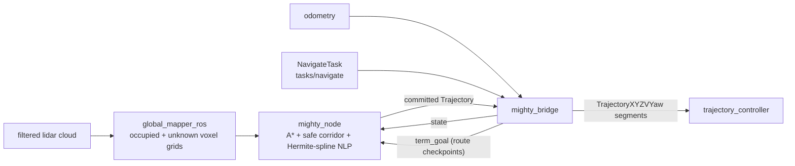

# asm_mighty

**MIGHTY** Hermite-spline local planner (Kondo, Wu, Kumar, How — MIT ACL /
UPenn, RA-L 2026, [arXiv:2511.10822](https://arxiv.org/abs/2511.10822))
packaged as an AirStack module, together with its **acl-mapping** voxel world
model and a **mighty_bridge** adapter onto AirStack's local-planner seam.

Replaces the DROAN local planner behind the exact same interfaces: the
`tasks/navigate` NavigateTask action and
`trajectory_controller/trajectory_segment_to_add` — the trajectory
controller, PID, safety monitor, and takeoff/landing pipeline are untouched.

## Why MIGHTY replaced DROAN

<!-- NOTE(privacy gate): the figures below show the pillar layout of the
     AirStack agent study's evaluation field (answer-key material while the
     study is running). This repo must stay PRIVATE until the study
     concludes — the figures are one of the reasons. -->

The swap was motivated by a judged obstacle-route evaluation in Isaac Sim
(the AirStack agent study's obstacle-avoidance rung): a 40×40 m pillar
field, fresh judge-issued multi-checkpoint routes per flight, judged on
simulator ground truth against a **1.0 m clearance gate**, a 2.5 m final
goal tolerance, and a 240 s/checkpoint budget. Same vehicle, same
trajectory controller, same safety monitor, same judge, same field — the
only variable is the local planner.

Quantitatively:

| | DROAN (`droan_gl`) frozen config | DROAN + yaw-sweep unstick (its best config) | **MIGHTY (this module, v0.1.0)** |
|---|---|---|---|
| Judged route passes | 0/5 | 0/10 | **5/5 official + 1 validation** |
| Collisions | 0 | 0 | 0 |
| Min pillar clearance | — (routes not completed) | 0.01–0.76 m (gate: 1.0 m) | **1.59–1.65 m** |
| Final goal error | — | — | **0.01–0.15 m** (gate: 2.5 m) |
| Dominant failure mode | absorbing hover (blocked collision votes) | close-quarters shaves past the gate | — |

DROAN's 2018-era reactive design has no persistent map: accumulated
collision votes cannot be erased by looking again, so cluttered pockets
become absorbing hover states, and its ~86° forward stereo FOV plus voxel
quantization produce close-quarters near-contacts. The yaw-sweep heuristic
eliminated the hovers (routes complete, zero crashes) but could not clear
the 1.0 m gate. Both failure modes are architectural — which is what a
map-based planner with explicit corridor margins fixes: MIGHTY holds a
persistent sliding voxel map with explicit unknown-space handling, plans
through convex safe corridors with a tunable clearance margin, and takes
the full 360° lidar.

Qualitatively, the flown tracks tell the same story — DROAN's tracks knot
into loops and mid-field wandering and terminate away from their route
ends; MIGHTY's are taut leg-followers with singular avoidance bulges,
every one terminating at the final checkpoint:



The clearance profiles show the margin mechanism directly: every MIGHTY
run's troughs cluster at 1.6–2.0 m — the planner's ~1.5 m nominal margin
(`planner_Co` 1.2 + half bounding box) plus tracking wobble — and never
approach the 1.0 m gate, versus DROAN's 0.01–0.76 m near-contact
distribution on the same field:



The judged-eval iteration that produced v0.1.0 also hardened the
integration itself (ten distinct defects found and fixed, from QoS
mismatches to replan-anchor timeline drift behind the trajectory
controller — see the git history dev1→dev10). Headline integration
lesson: a timeline-open-loop planner running behind a tracking controller
needs **vehicle-anchored replanning** and a **receding-horizon
`trajectory_override` handoff**, both now built into `mighty_bridge`.

## Architecture



- **global_mapper_ros** (acl-mapping): sliding-window voxel map that follows
  the drone (occupied + unknown voxel-center clouds), registered via TF
  (`map` -> lidar frame).
- **mighty_node**: A* front end over the voxel map, convex safe-flight
  corridors (DecompUtil), quintic-Hermite-spline soft-constrained L-BFGS
  back end (GCOPTER-derived — no solver licenses). CPU-only.
- **mighty_bridge**: serves NavigateTask (walks the goal path's poses as
  successive `term_goal` checkpoints; a newer goal preempts the active one;
  `navigate_timeout_s` bounds an unreachable goal), follows a `global_plan`
  route once airborne, converts odometry -> `dynus_interfaces/State` (twist
  rotated to world frame), and converts each committed
  `dynus_interfaces/Trajectory` into a decimated `TrajectoryXYZVYaw`
  published as a receding-horizon `trajectory_override`. The bridge puts the
  trajectory controller in TRACK mode before it forwards overrides (AirStack
  0.20.x leaves it in ROBOT_POSE after takeoff, where overrides are merged but
  never flown) and, on completion of a leg, turns the vehicle to the leg's
  requested yaw (`arrival_yaw`) — MIGHTY itself drops the goal orientation.

## Packages

| Package | Origin | Role |
|---|---|---|
| `mighty` | vendored (mit-acl/mighty) | planner core (+ fake_sim, gtests) |
| `dynus_interfaces` | vendored | State/Goal/Trajectory/DynTraj msgs |
| `decomp_util`, `decomp_ros_msgs` | vendored (DecompROS2) | convex decomposition + msgs |
| `decomp_ros_utils` | new shim | header-only decomp<->ROS conversions (no rviz deps) |
| `fla_interfaces`, `fla_utils`, `global_mapper`, `global_mapper_ros` | vendored (acl-mapping) | voxel world model |
| `mighty_bridge` | new | AirStack seam adapter + canonical module launch |

Pins, licenses, and the Jazzy-port patch list: [VENDORED.md](VENDORED.md).
Everything is BSD-3/Apache-2.0-class permissive; **no Gurobi**.

## Install

```bash
airstack module add https://github.com/castacks/asm_mighty --version v0.1.2
airstack module lock --build     # bakes the nlohmann-json3-dev dep layer
airstack up --stack full_mighty --sim isaac
```

Or use the `full_mighty` reference stack in AirStack, whose `modules.repos`
pins this module.

## Interfaces (canonical launch args)

See `mighty_bridge/launch/mighty_module.launch.xml` — every cross-module
endpoint is a declared arg with a canonical default:

| Arg | Default | Direction |
|---|---|---|
| `mighty_lidar_topic` | `/$ROBOT_NAME/sensors/ouster/point_cloud` | in |
| `mighty_lidar_frame` | `ouster` | (TF) |
| `mighty_odometry_topic` | `/$ROBOT_NAME/odometry_conversion/odometry` | in |
| `mighty_global_plan_topic` | `/$ROBOT_NAME/global_plan` | in |
| `mighty_trajectory_override_topic` | `/$ROBOT_NAME/trajectory_controller/trajectory_override` | out |
| `mighty_set_trajectory_mode_service` | `/$ROBOT_NAME/trajectory_controller/set_trajectory_mode` | out (srv) |
| `mighty_navigate_task_action` | `/$ROBOT_NAME/tasks/navigate` | serves |

## Configuration

- `mighty_bridge/config/mighty_airstack.yaml` — planner params (v/a/j limits,
  z band, clearance margin `planner_Co`, bbox). Derived from upstream
  `mighty.yaml`; AirStack-changed values documented in the header.
- `mighty_bridge/config/global_mapper_airstack.yaml` — voxel map (window
  size follows the drone in all axes, resolution, hit/miss).
- Bridge params — set on the `mighty_bridge` node:

  | Param | Default | Meaning |
  |---|---|---|
  | `waypoint_tolerance_m`, `segment_stride`, `term_goal_republish_s`, `override_period_s` | | checkpoint walk, decimation, `term_goal` republish, override rate |
  | `navigate_timeout_s` | 240 | abort a NavigateTask that has not reached its goal (0 = never) |
  | `follow_global_plan`, `follow_min_climb_m`, `follow_settle_s`, `follow_lookahead_m` | | `global_plan` follower: enable, takeoff-climb gate, settle time, carrot lookahead |
  | `follow_plan_stale_s` | 15 | drop a route whose `global_plan` went silent this long (0 = never) |
  | `follow_airborne_above_m` | 0 (off) | count the vehicle as airborne above this map altitude, so a bridge (re)started mid-flight still engages |
  | `catchup_release_s` | 6 | max time the follower withholds carrots while MIGHTY flies to its committed end |
  | `arrival_yaw` | `goal` | on completion of a leg: `goal` = the final pose's yaw (hold heading when its quaternion is identity), `hold` = keep heading, `off` = MIGHTY's behaviour (lands facing +x) |
  | `arrival_yaw_velocity` | 0.3 | velocity of the two-waypoint turn-in-place override |

## Changelog

- **v0.1.2** — bridge seam fixes from flying the module on AirStack 0.20.x
  (RayFronts notebook/067): TRACK mode before overrides (the "planner never
  replans" hang), NavigateTask timeout + preemption, stale `global_plan`
  drop, mid-flight restart gate, catch-up gate release, "route completed"
  memory only while still at the end, and arrival yaw. Numbered FIX 1-7 in
  `mighty_bridge/bridge_node.py`'s docstring and log lines.
- **v0.1.1** — receding-horizon `trajectory_override` replaces ADD_SEGMENT
  merging; vehicle-anchored replanning; follower completion contract.
- **v0.1.0** — first release (judged-eval hardening, DROAN comparison).

## Testing

- `colcon test --packages-select mighty` — 6 upstream gtest suites (44
  tests) including the L-BFGS gradient check.
- `tools/smoke_sim.py` — standalone synthetic-input smoke harness (no Isaac,
  no controller): publishes odometry + a synthetic pillar cloud + TFs at
  canonical names; then exercise the NavigateTask action and watch
  `trajectory_segment_to_add`.
